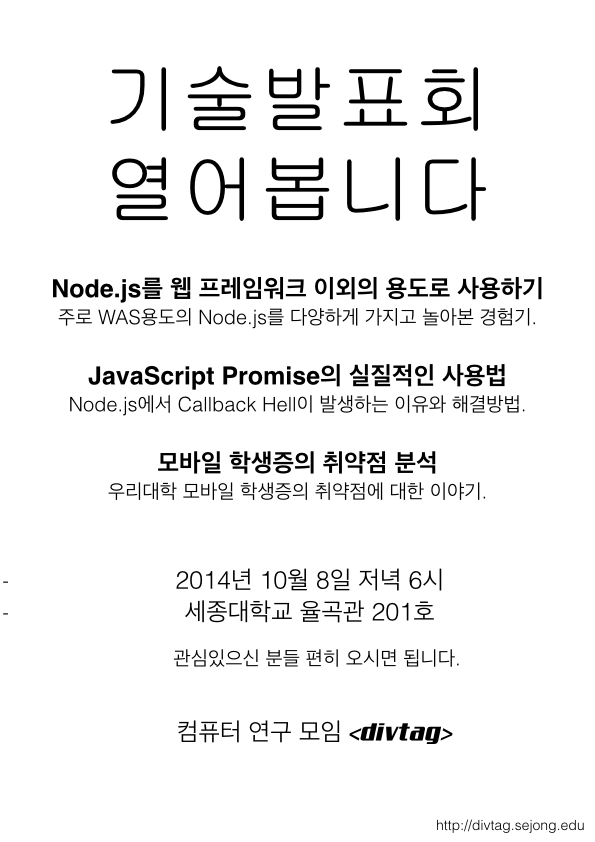

###목표

divtag 개발자 모임의 목적은 프로그래밍에 관심있는 학생들이 경험해본 기술과 만든 제품을 공유하고 소개하여 다양한 분야의 지식을 습득하고 소프트웨어 개발에 열정이 있는 사람들을 만날수 있는 모임을 목표로 하고있니다.

우리대학 소모임인 divtag에서 관심사가 비슷한 개발자들을 만나고 싶다. 라는 바람에 의해서 만들어 졌으며, 이제 그 바람를 실현해보려고 합니다. 처음 하는 모임이기에 모임 참석자와 기획자가 같이 의견을 주고 받으며 지속적으로 발전시켰으면 합니다.

###발표 주제

**Node.js를 웹 프레임워크 이외의 용도로 사용하기 by 황찬욱**

Node.js는 그 정의에도 Scalable한 Network Application을 만드는데 강점을 가지고 있고 합니다. 이러한 WAS용도로 Node.js를 사용하지 않고 다양하게 가지고 놀아본 이야기를 해볼 생각입니다.

**JavaScript Promise : Practical Example (자바스크립트 프로미스의 실질적 사용법) by 김희언**

[Node.js](http://nodejs.org)의 등장으로 JavaScript를 사용하여 복잡한 Business Logic을 작성할때 나타나는 문제점중 하나인 [Callback Hell](http://callbackhell.com)을 [Promise](http://promisejs.org)기법을 통해 해결하는 방법을 공유해볼 생각입니다. 더불어 JavaScript가 Callback을 사용하게된 이유와 Node.js의 구조에 대해서도 간단하게 이야기를 나누어볼 생각입니다.

**모바일 학생증의 취약점 분석 by 황찬욱**

최근 본 모임의 [제보](https://www.facebook.com/photo.php?fbid=501881023282569&set=a.134498483354160.26848.100003820279887)로 우리대학 모바일 학생증의 문제가 세종대 신문에 보도되었습니다. 이에 대해 이야기해볼 생각입니다.

###일시및 장소

2014년 10월 8일 수요일 / 늦은 6시 / 세종대학교 율곡관 201호

<a href="../static/events/divtag-october-2014.ics">내 캘린더에 이벤트 저장하기</a>

<iframe src="https://www.google.com/maps/embed?pb=!1m18!1m12!1m3!1d3163.1378411895407!2d127.07404389999999!3d37.55181610000001!2m3!1f0!2f0!3f0!3m2!1i1024!2i768!4f13.1!3m3!1m2!1s0x357ca4d04ef3d389%3A0x322585c169b1b2bf!2z7ISc7Jq47Yq567OE7IucIOq1sOyekOuPmSDshLjsooXrjIDtlZnqtZAg7Jyo6rOh6rSA!5e0!3m2!1sen!2skr!4v1412131606053" width="290" height="290" frameborder="0" style="border:0"></iframe>

###문의처

contact@divtag.sejong.edu

###홍보물

