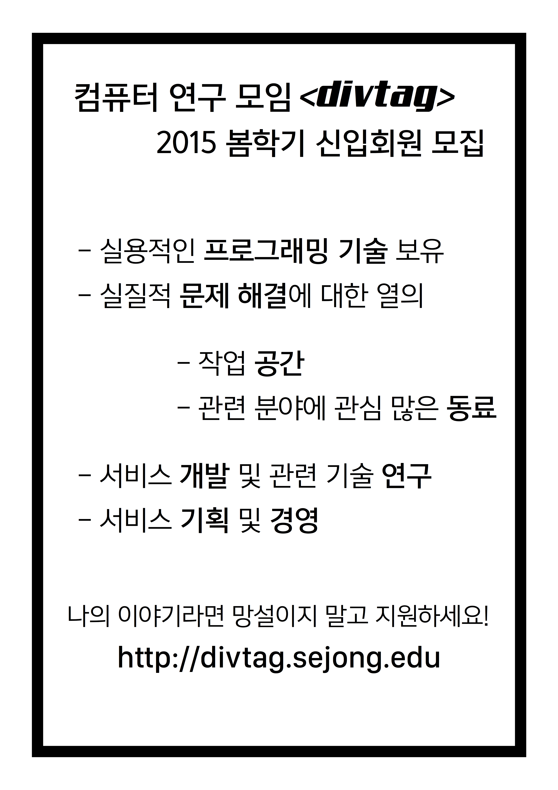

&lt;divtag&gt;는 컴퓨터와 관련된 분야에 관심을 가진 학생들이 모여 연구, 개발을 하기 위한 목적으로 만들어진 모임입니다. 

2014년 3월 31일 창설이후 1년 동안 [공개](/history/) / 비공개적으로 여러 활동을 하였습니다. 초기에는 웹서비스 개발및 연구를 중심으로 진행하였고, 현재는 컴퓨터 전반으로 주제를 확장하였습니다. 

&lt;divtag&gt;는 하고 싶은것을 하자 라는 학풍아래, 다양한 분야의 연구, 개발을 진행하고 있습니다. 

저희는 하드웨어나 직접 제작한 FPS게임에서 재미를 느끼는 사람입니다. 저희는 웹서비스로 학교와 사회의 문제를 해결하는데 즐거움과 열정을 느끼는, 그런 부류의 사람입니다.

컴퓨터와 관련된 분야에서 관심이 많으신 분이 계시다면, 또 그러한 사람들을 만나고 싶으시다면 지원 부탁드립니다.

<a href="https://docs.google.com/forms/d/1pnBbCG1ymibZ4NMkzqwXviJ2LyEdGQ-hlrZE5p2VYVM/viewform" target="blank"><button type="button" class="btn btn-info">지원하기</button></a>