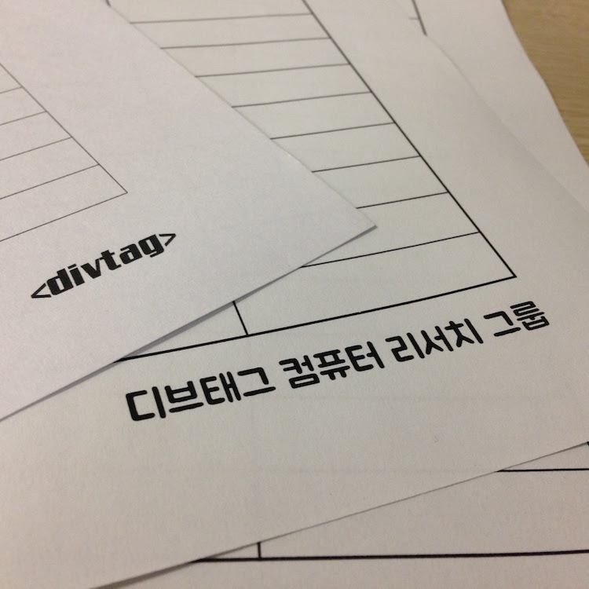

 

언젠가 한번 명시적으로 정리하려곤 했었어요. 이미 우리 모두가 잘 알고있지만, 그렇기 때문에 더더욱, &lt;divtag&gt;가 무엇을 위해 존재하는지, 우리가 존재의 이유를 동감한다면 어떻게 운영해 나갈 것인지에 대한 제 의견을 공개적이고, 명시적으로 전달해 보려고요.
 
<blockquote style="margin-right: 5px;">
  
&lt;divtag&gt;는 일반사용자용 소프트웨어 개발 관심 있는 학생들에 대한 지원 및 교류를 활성화하기 위한 동아리이다.

</blockquote>
여기서 말하는 일반사용자용 소프트웨어란, 주로 웹및 모바일앱을 기반으로한 소프트웨어로, 일반인을 중심으로 하되, 개발자등 모든 종류의 사용자들 다 포함한것입니다. 저는 이 한줄의 Quote에 나온 단어들에서 우리 동아리가 나아갈 방향을 찾을수 있다고 생각합니다.

지원, 어떤 지원을 어떠한 목적으로 어떻게 하며느냐가 중요할 것입니다. 크게 물적 및 인적자원으로 보았을때, 우리는 passionate하고 자신이 해결하려는 문제에 대해 깊은 tenacity를 가지고 있는 회원들이 있으며, 이러한 회원들의 활동을 바탕으로 다시 그러한 회원 맞이할 것입니다.

기본적으로 작업공간을 제공함으로써, 관심 분야를 같이하는 사람들끼리 같은 프로젝트의 진행 여부과 관계없이 ( 이것이 얼마나 어려운지 아시리라 생각합니다. )건설적인 토론과 피드백을 주고 받으며, 개개인에 기술적 역량을 향상시킬수 있는 환경을 조성할수 있다고 생각합니다. 고도의 제한되고 선별된 인재들이 모여, 평소 상상하기 힘든 큰 일을 할수 있다고 생각합니다.

국내에서 몇몇 학교만 가능한, 특출난 인재들이 많은 본교의 특성과 함께, 같은 관심분야를 가진 좋은 인재를 다른 동아리에서 놀게 하는것은 그 사람과 우리의 인생에서도 큰 기회를 놓치는 것이 생각하여, 앞으로도 활발하게 영입활동을 진행햐주셨으면 합니다.

교류, 최초로 진행된 <a href="/first-meetup">제1회 divtag 개발자 모임</a>을 통해, 그리고 그것을 기반으로 앞으로 열릴 컨퍼런스를 통해 제가 이루고 싶었던 것 기술의 전문성이 갈수록 심화된 지금, 타 분야의 기술에 대한 실용적인 내용과 삽질기를 들음으로써, 새로운 기술에 대한 빠른 이해 동시에, 교내에서 관심이 많은 관련 분야 사람들과의 교류를 증진을 위해서 입니다. 

현재까지는 실현되지 못했지만 초기 서비스의 소개장 될수도 있다고 생각합니다. 앞으로도 지속적인 컨퍼런스 주최및 기타 기여 활동을 통해 이러한 활동을 이어나갔으면 좋겠다고 생각합니다.

활성화, Vibrant한 환경을 만들기 위해선, 동아리에는 철학자가 많아야 한다고 생각합니다. 동아리가 보유한 기술적 역량을 바탕으로 사회와 세상에 있는 문제를 해결하는것에 심취한다면 동아리는 차가워질수가 없을 것입니다.

갈수록 고도화된 시장에서 경쟁하려면, 높은 퀄리티의 제품이 필요하고, 높은 퀄리티의 제품은 적절한 모듈 및 레이어 단위의 분업을 위한 페어프로그래밍과 핵심역량및 정확한 타겟유저등 기획에 위한 협업으로 만들어 질수 있다고 생각합니다. 물론 현재 제가 생각하는 제품 개발방법인 Self-Bootstrapping방법 역시 틀리다고는 생각 하지 않으나, 페어프로그래밍이 생산성 더 효과적이라고 생각합니다. 기본적으로 본 분야에 관심이 있어서 회원이 되신 만큼, 그것을 잊어버리지 말고 같이 사람들의 사용패턴및 시장의 변화를 주시하며 유연한 사고를 기반으로 가치있는 제품을 같이 만들어보았으면 좋겠습니다.

동아리, 현재 &lt;divtag&gt;는 융합창업연계전공에 소속되어 2개의 창업동아리로 구성되어 있습니다. 저는 이전에도 밝혔듯이 시장의 불확실성이 커지고, 시장의 특성 자체를 이해한다면, 동아리와의 역할은 회원들의 Side Project를 지원해 주는것이 옳다고 생각합니다.

Y Combinator의 Paul Graham이 그의 글 <a href="http://paulgraham.com/ds.html">Do Things that Don't Scale</a>에 밝힌것처럼, 오늘날의 일반자용자용 서비스및 소프트웨어는 초반부터 사업이라는 명목아래 static하게으로 진행할수 없는 상황에 놓여있습니다. 대표적인 이유는, 우리는 우리의 고객군이 누구인지 모르며, 지속적인 피드백으로 제품을 개선시키는 과정속에서 그러한 불확실성은 더욱 증가할 것이기 때문입니다. 또한 Paul은 우리가 사용하는 많은 제품이 사업 자체를 목적으로 하기 보단, 단순히 재미로 시작한것이 많다고 합니다. 물론 그들 자신도 자기의 hack이 크게 성장할지 예상하지 못하였고요.

저는 이 부분을 반만 동의합니다. 재미로 시작한것이 사람들의 삶에 많은 영향을 준 제품과 서비스를 만들었다면, 그걸 경험한 우리같은 사람들은 재미로 시작하는 정신을 간직하고 지키되, 그 제품을 크게 성장시키고 싶을 것입니다. 우리는 이미 그러한 신화를 경험한 사람들이니까요. 때문에 동아리를 지나치게 과열시키는, 또 Big Data와 같은 오늘날의 Buzz Word인 '창업'에 연관 지을 생각은 없습니다. 그러나 우리 마음 한구석에는 가치있는 문제를 해결하고 사업화(창업)을 통해 지속적으로 그것을 운영하고 성장시키고 싶은 마음이 있는것은 부정할수 없는 사실입니다. 결론은 우리 모두 시도는 하되 작게 시작하였으면 좋겠습니다. (again, do things that don't scale.)

한가지 더 말씀드리고 싶은 부분은 시간입니다. 우리는 제한된 시간속에서 프로젝트를 진행하고 있으며, 모두들 인생에서 가장 값지고, 중요한 시간중 일부를 투자하여 여기에 있는 것이라고 예상됩니다. 우리가 만드는 제품과 서비스를 그러한 시간을 투자하여 만든것이기에, 나와 팀원들의 그러한 시간을 뺏어서 만든 것이기에 우리는 그것들을 성공시키도록 다양한 방면에서 최대한 노력할 책임이 있다고 생각합니다.

더불어 저는 이러한 정신과 중요성을 연계전공측에도 전달하고 동아리의 정체성을 명확히하는데 기여할 것입니다.

왜 일반사용자용 소프트웨어 인가? 우리가 중고등학생일때부터 지금까지 수 없이 되뇌어왔던 질문입니다. 저는 '영향력'이라고 생각합니다. 실제 사회와 나라가 동작하는 것에 우리가 만든 소프트웨어가 어떤 형태로든 좋은 영향력을 미칠수 있다면, 조금이나마 도움이 된다면 즐거울것 같습니다. 그렇기 때문에 일반사용자용 소프트웨어를 선택해왔고, 또 선택해 갈것 같습니다.